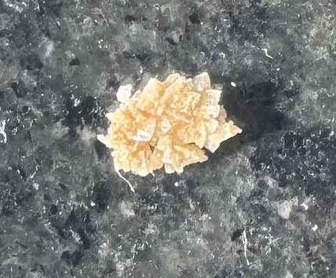

# The Missing Kidney Stone Manual
{:.no_toc}

* make the toc an unordered list
{:toc}

I had a kidney stone in January 2025.  I was absolutely shocked how
little information was out there on what I would go through.
*THIS IS NOT MEDICAL ADVICE*.  It is me documenting what I went
through and what I wish I knew going in.

I want to state up front:

 * I am male and some of this information is specific to my equipment.
 * There are explicit descriptions of uncomfortable and/or icky things
   here. Be warned.

**NOTE**: on Feb 13, 2025 I got the news that the kidney stone
composition was calcium oxalate dihydrate.

## What it is

Crystals can form in your kidneys, for reasons, and when they get big
enough they are called stones.  I've known people who had really large
ones that were _stuck_ in the kidney (due to their size) and had to be
surgically removed.  If they are small enough they can pass from your
kidney to your bladder and out into the world.  Here's the anatomy
lesson:

My stone was 3mm.  Pretty small, all things considered.  This is the
actual spikey bastard:

Not the best picture, but you can see it's not round.  That's the
first misconception I had with kidney stones, that they are round and
smooth.  And it's not smooth.  More on that later.

## Why Pain

When the spikey bastard moves from the kidney down the ureter toward
the bladder is when the fun begins.  The pain usually starts in the
_flank_.  Your lower back, off to one side (depending on which kidney
the stone is in), above your hip bone.  The pain will appear, rise in
intensity, hit a maximum and then drop off again to nothing.  This is
the way a lot of people experience it.  Waves of pain, then periods of
no pain.  Those periods of no pain can be long or short.

As the spikey bastard moved through the kidney, into the ureter, into
the bladder, into the prostate and finally into the urethra it causes
bleeding.  That bleeding will make your urine look dark and
orange-ish.

Below, I will use the 1-10 scale of pain, 10 being the maximum you can
imagine.  0 being no pain.

## The Journey

Keep in mind, I captured my urine to capture the stone.  I did not
want it escaping down the toilet.  I want it to be analyzed by a lab
to know what type it is, so I can take preventative actions so I do not
go through this again.

### Day 0

I drank more water than usual the day before, but I urinated much less
than expected and when I did it was dark and sort of in orange color.
It was a little worrying, but I decided I was probably mis-remembering
the amount of hydration.  ⚡_foreshadowing detected_⚡

### Day 1

At 3am, I woke up and noticed some flank pain, probably a 0.5 for 10
minutes (henceforth 0.5p/10m).  I was confused, but after thinking
about it a few minutes I was like "uh, oh... is this a kidney
stone???"  I tried to go back to sleep, but couldn't.

4 hours later it happened again (2p/20m).

2.5 hours later it happened again and was an 8 or 9 pretty
immediately.  I was in so much pain I didn't think I could walk
upstairs.  I was able to make it upstairs and immediately called 911.
They arrived in 5 minutes, and by the time we got to the ER it was
gone.  So, the pain was 9p/15m.  I want to point out that 15 minutes
is a _long time_ to be at a 9.  There were times I didn't know if I
could withstand it.

While at the ER I got fluids and when I started to pee I had flank
pain at about a 2, which would go away when I lay back down.

Also, while in the ER, they ran a battery of blood tests, all of which
came back normal except the ones that detected blood in my urine.  I
had a lot of blood there.  They also did a CAT scan and found the sole
3mm stone was almost to the bladder.  Whew, I thought.
⚡_foreshadowing detected_⚡

That evening, I had a spikes of flank pain, probably a 6, that lasted
for an hour.  This happened a few times through the night.

I had hydrated a _lot_ during the day and I feel I didn't really urinate
as much as I thought I should have. ⚡_foreshadowing detected_⚡

In the ER, I was given a prescription for Flowmax (aka Tamsulosin), to
help with getting the spikey bastard out.  Apparently it makes the
ureter smooth, to facilitate the journey.  We want the spikey bastard
to be comfy, right?!

### Day 2

I was able to sleep only a few hours.

The phenomenal ER nurse told me I would feel it move from my flank
around to the front, literally in a line toward my crotch and toward
my the base of my penis.  And, indeed, that is what I felt, over the
course of a couple of hours.  It wasn't too painful.  Probably a 1-2,
intermittently.  It was a _very weird feeling, though_.  I would look
down at my waist and imagine it moving through the ureter.

Around 9:30am I had to urinate really badly.  I believe that is when
the spikey bastard moved from ureter to bladder.  It sort of opened a
flood gate, so to speak.

At this point, I thought it was all over, having forgotten about the
ER nurse comment above.  ⚡_foreshadowing detected_⚡

### Day 15

I had flank pain around 5am that was similar to the initial pain on
day 1.  I freaked out that I had a _new_ stone that made it into my
ureter.

Kaiser got me to a Dr who told me it was probably referred pain from
the original stone, still moving through my system.  After all, I had
not seen the spikey bastard, so I thought this was likely.  I hydrated
like crazy all day and had no further pain.

### Day 17

I had a really odd sensation in the area where my prostate is.  I
really struggle to describe the sensation, because it so unlike
anything I've ever felt.  I'll call it a _low-level tickle_ in that
area.  It was neither unpleasant or painful.  It just was.  It was
with me for days and I learned to ignore it.

I assumed then and now that the spikey bastard had left my bladder and
entered my prostate.  I was hoping it wouldn't stay there long and
would soon be available for pictures.

### Day 20 (approx)

I stopped taking Flowmax/Tamsulosin because I didn't feel like it was
really doing anything and I had watched a video from the Buck
Institute that said any new symptom, in geriatric patients, was
assumed to be caused by existing/new medications.  I was having
unrelated medical issues and decided it was best to remove this from
my regimen.

### Day 24

I had a weird shooting pain in my testicles.  Didn't last long, was
probably a 4, but very brief.  Happened like 2-3 times.  Then never
again.

### Day 25

During the day, while urinating, it felt like something spikey had
left my prostate and was making a break for freedom.  It wasn't really
that painful, probably a 1, but it wasn't comfortable, either.  I
hydrated a _lot_ that day but I couldn't seem to get it to move.

This is what I pictured in my mind's eye:

### Day 26

The spikey bastard moved to within 2 inches of freedom.  This was not
a pleasant feeling.  I would say this state persisted for 4-5 hours.
For all of that I was hydrating like crazy and most of it I was
sitting still.  The pain varied from 1-4, but it was weird pain.  Very
hard to describe.

After urinating about 5 times, it finally saw the light of day.  It
was free.  I plan to give it to my Dr for analysis, to see what it's
made of, because that should tell me what I need to do to prevent one
in the future.

## My Urologists recommendation to prevent them in the future

This was the entire contents of the last message my urologist sent me
(unedited, other than formatting):

1. Please increase your fluid intake to reach a goal of at least 2
   liters of urine daily. You will likely need to drink 2.5 - 3 liters
   of fluid a day to do this. The good news is that almost any fluid
   counts towards this 2.5 – 3 liter total, but water is best. Carry a
   water bottle with you. It is important that you drink water
   multiple times a day. You may need to get up at night once to
   urinate, which is okay.
 
1. Water is best, but you may have flavored water (crystal light),
   mineral water or citrus juices. Any fluid is beneficial EXCEPT for
   colas, canned juice (high in sodium) and cranberry juice (high in
   oxalate). Coffee and tea are okay in small amounts, although some
   teas are very high in oxalate. You can also add some dilute
   lemonade or lemon juice to your diet to increase your citrate
   consumption which prevents stones. One option is to add 120ml of
   concentrated lemon juice to 2 liters of water and drink throughout
   the day.
 
1. Please reduce your dietary salt intake by reducing the use of the
   salt shaker, using potassium based salt substitute (Mrs. Dash, for
   example), eating out less (limit to 1-2 times a week at most), and
   being aware of the sodium content of foods when shopping. *Limit
   sodium intake (<2000mg/day). Most salt intake comes in prepared
   food.  Remember “The 5 Rule”: Avoid foods in which the word salt or
   sodium is listed in the first 5 ingredients.
 
1. Please reduce your total animal protein intake during individual
   meals. It is better to have multiple small portions (3 ounces) of
   animal protein throughout the day than one large protein-rich meal.
   A diet rich in fruits, vegetables and fiber lowers your risk of
   stone formation. A high animal protein diet increases urinary
   calcium and oxalate and decreases citrate levels and urinary pH,
   all of which increases your risk of stones.
    
1. A normal amount of calcium in the diet is actually beneficial. If
   your calcium intake is too low or too high it can lead to stones. A
   normal amount of calcium of about 1200mg per day should be
   maintained in your diet. Please add a half of cup of yogurt, milk
   or take a calcium citrate pill with meals, especially meals with
   high oxalate content (lunch and dinner). It is important not to
   reduce your calcium intake; this is true even if your stone was
   made out of 'calcium.' Four 8 oz. glasses of milk equals 1,200mg
   calcium. Any calcium supplements must be taken with a meal.
 
1. Please continue to eat a healthy diet with lots of fruit and
   vegetables but try to avoid a few extremely high oxalate foods such
   as spinach, beets, almonds and tofu. Avoid excess vitamin C as
   well. 

## Medication

On pain medication, I was given zofran in the ambulance by EMS.  I was
given toradol in the ER.  The nurse said it worked better than opiates
and that opiates didn't work very well for kidney stones.  Speaking of
which, I was given an oxy prescription during discharge at the ER and
I filled it, but I didn't take any of it.  I'm extremely wary of oxy,
for obvious reasons.  I wish I didn't waste the $15 copay.  Now I
think I'll just take it back to Kaiser for disposal.  I don't want
that stuff in the house.

While I was still passing the stone into my bladder I did a
combination of Tylenol and Aleve.  I did the max dose of both,
staggered, for probably 24 hours.

## Final thoughts

I know everyone has a different experience with kidney stones, but I
suspect that much of what I experienced I share with other sufferers
of kidney stones.

I was just shocked how little information was available anywhere on
the internet.  I looked everywhere.  I spend hours searching.
ChatGPT, et al.  Google.  Medical websites.  Almost none of what I
wrote above was available.

I wrote all of this on the off chance it one of my fellow travelers.
