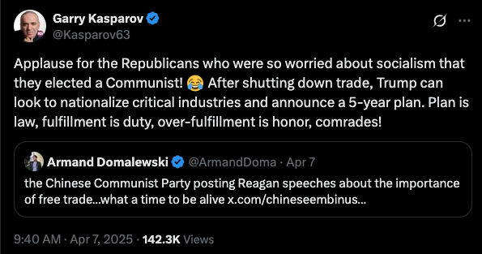

# Trump, Tariffs, Mao and more

-------------------------------------------------------------------------------

**NOTE: the text below was not written by me and is from various sources
(as indicated).**

-------------------------------------------------------------------------------

[hayst4ck](https://news.ycombinator.com/user?id=hayst4ck){:target="_blank"
rel="noopener"} [wrote](https://news.ycombinator.com/item?id=43627686){:target="_blank" rel="noopener"}:

> These tariffs are a radical action that rhymes with the "Four pests"
> campaign of Mao Zedong's China which led to one of the worst famines
> in human history.
> 
> Defenders of these tariffs say they might bring back manufacturing or
> say they are a response to some bad effect of the current state of
> America... They don't accept what the experts say, but what their
> authority says, and their authority says that these will bring
> manufacturing back. The current argument in the face of backlash is
> "let's wait and see."
> 
> Mao Zedong, another populist authoritarian who didn't like to listen
> to experts or acknowledge reality implemented the four pests
> campaign. Sparrows were eating Chinese crops, much like trade deficits
> eat American labor. Mao decided it would be wise to kill these pests
> to protect the crops, failing to predict that the death of these
> sparrows would cause even worse pests to damage crops.
> 
> This led to one of the worst famines the world has ever experienced.
> 
> China's cultural revolution (our project 2025) and great leap forward
> (liberation day) had truly disastrous effects like the four pests
> campaign for those who lived through them.
> 
> If there are no checks on this administrations power soon, we are
> likely to see even more short sighted incompetent policy that
> radically changes society that will damage us for generations.
> 
> In china they erase history because history gives you a foundation to
> judge your leaders. "Purifying" the Smithsonian is an admission that
> understanding history there there would make you dissent from what
> will happen or be dissatisfied with some of your leaders in the past
> who might be similar to current leaders. We should take the lesson's
> of history and understand that what is happening now rhymes with
> everything the America I grew up in, including the conservative
> America, stands against, like unchecked power.
> 
> It might get better... but it can also get much much much worse.

[Reply](https://news.ycombinator.com/item?id=43629564) from
[Danmctree](https://news.ycombinator.com/user?id=Danmctree):

> Yes the current period is reminiscent of the Mao period in more than
> one way. You've got blind loyalty and optimism by the followers,
> unwillingness to listen to critism, anti-intellectualism, attempts
> to purge aspects of culture and dissappearing disliked people to
> faraway prisons.
>
> It's not gone nearly as far as in that period, but we ought to be
> careful not to get closer. When information countering government
> policy is suppressed, the mistakes keep growing bigger until the
> consequences become so grave they can no longer be ignored.

[Reply](https://news.ycombinator.com/item?id=43628562) from
[everybodyknows](https://news.ycombinator.com/user?id=everybodyknows):

> > four pests
>
> Mao's "backyard" steel furnaces might be an even better comparison:
>
> https://en.m.wikipedia.org/wiki/Great_Leap_Forward

This connection to communism was noticed elsewhere.
[Garry Kasparov](https://x.com/kasparov63/status/1909285114846081348?t=UrMvOG27LOMrXA5udsjgiQ)
on X:

> 

If the goal was to bring back manufactoring, we
know how to do that,
[A_D_E_P_T](https://news.ycombinator.com/user?id=A_D_E_P_T)
[points out](https://news.ycombinator.com/item?id=43622623)

> There's a way to do it. This playbook has been used repeatedly
> throughout the 20th century.
> 
> First you invite industry to reshore via subsidies and preferential
> access to government contracts. If necessary, the government must
> directly invest in new firms. (They already do this in a very small
> way with [In-Q-Tel](https://en.wikipedia.org/wiki/In-Q-Tel)
> and others, so it's not totally beyond the
> pale. For a time there was even a US Army VC firm.) If you talk to a
> Chinese factory owner or mine boss, many of them will tell you that
> they got their start with a >$2M direct investment from their
> government.
> 
> Second you gradually tighten the screws on foreign finished
> products, not industrial inputs like metals, plastics, ores, etc.
> 
> Third you streamline export paperwork requirements and relax things
> like
> [ITAR](https://en.wikipedia.org/wiki/International_Traffic_in_Arms_Regulations)
> (International Traffic in Arms Regulation).
> 
> Then, when that's all humming along and the factories are working,
> you can launch blanket tariffs to protect your nascent industries,
> if need be. But you must exempt necessary industrial inputs from
> tariffs.
> 
> What's happening now is completely backwards/inverted and it's going
> to lead to total chaos.

The Big Picture since 1980 and
[how we got here](https://news.ycombinator.com/item?id=43631896)
by
[afpx](https://news.ycombinator.com/user?id=afpx):

> Here’s my hot take on a messy topic.
> 
> Margaret Thatcher and Ronald Reagan began implementing
> Neo-conservative / Neo-liberal policies in the 80s. This shifted the
> UK and US economies to high margin things like pharma, finance,
> technology, and services. Those things stayed in the US. Everything
> was outsourced to developing countries.
> 
> It sounded great. Through free-trade, developing countries would
> improve their standard of living. Also, democratic countries didn't
> go to war with each other. So, this led to the conclusion that
> improved trade between wealthy nations and developing nations would
> lead to global harmony. Everyone's standards of living would
> increase, and we'd all be one happy globe.
> 
> The US kept trying to push democracy, often through force and by
> destabilizing governments. But, for some reason countries weren't
> adopting it. The reason was that academics and political leaders
> didn't account for the impact of culture. That is, a lot of
> countries didn't want democracy and free-trade.
>
> A lot of areas of the US eventually got wiped out economically. But,
> *for a long time, they didn't notice*. Things stayed relatively stable
> for a few decades because prices kept falling from all of the
> incoming cheap goods. Meanwhile, they faced 'brain drain' - the next
> generation started getting college degrees and moving to the wealthy
> cities. Some areas became wealthy - the rest became poor.
>
> The US became a powerhouse of tech, services, and finance. But, they
> didn't have enough skilled labor in the cities. So, the US opened
> the door to immigration. As GDP increased, salaries went up. People
> started flocking to the US both for high-end jobs and also low-end
> jobs to support all of the urban areas. The poor areas of the US
> became enraged - new immigrants had more money than them, and they
> had less.
>
> Trump (and I assume the think tanks behind him) believes these
> tariffs are a last ditch attempt to fix the system. Otherwise, the
> US dissolves.

The emphasis above is mine, since I (like some of the replies)
disagree with the notion these economic problems were *not noticed*.
