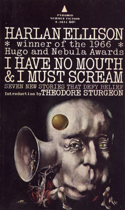

# The time Harlan Ellison called my house at 2am

## ...and how I met Robert Silverberg 

When I was approximately 17 (in the 1970's), [Harlan Ellison](https://en.wikipedia.org/wiki/Harlan_Ellison) called my house at 2am.

For those that don't know, Harlan Ellison is a Science Fiction writer, most famous for a Star Trek episode and his sci-fi novels, for example [I Have no Mouth, and I Must
Scream](https://en.wikipedia.org/wiki/I_Have_No_Mouth,_and_I_Must_Scream).

The cover art alone is crazy enough:

But when I read this book as a teen, before he called my house at 2am, it was quite an experience.

Let me set the stage for the phone call:

It was the 70's, a time when phone calls were not cheap, as they are
today.  It was also rare for middle class families to have more than a
single phone in the house.  If there was more than one phone, there
certainly wouldn't be a phone in each bedroom.  It was really common
at the time to have a really long extension cord, so the phone could
reach into different bedrooms.  That was the case at my house.  The
single phone upstairs could reach from my parent's bedroom, where it
was plugged in to either of the other rooms on the second floor.

On the night in question, I was awake and had the phone in my bedroom.

Also pertinent to the story is that [Martin H
Greenberg](https://en.wikipedia.org/wiki/Martin_H._Greenberg) and his
family were staying at our house.

I was close friends with his step-daughter when we were younger and
lived in Miami, FL.  I also adored his wife, and my friend's mother,
Sally.  In my teen years, she was one of two adults that were unlike
any others.  I related to her and could talk with her.  Unfortunately,
she (and Martin) have passed away, but I still think of her from time
to time.

Martin was in town for a sci-fi convention.  I have tried several
times to find information about this event, but have failed.  Perhaps
it was more of a private meeting of sci-fi writers?  I know that
[Robert Silverberg](http://www.robert-silverberg.com/) went because I
drove Martin to Robert's house, so he could hitch a ride to Lake Tahoe
for the event.  I took along a few Silverberg's books and he
graciously signed them.  There was a little awkward chit chat before I
drove home.

Lastly, I can't say enough about how unusual it would have been to get
a phone call in the middle of the night.  I literally don't remember
ever hearing the phone ring in the middle of the night.  It just
didn't happen.

So, in the wee hours of the morning, the phone rings:

> me: Hello?

> caller: Let me talk to Marty.

> me: \<pause\> uh \<pause\>  it's 2am and everyone is asleep.
> \<pause\> Who is this?

> caller: This is Harlan Ellison.  Go wake him up.

> me: \<pause\> ok

I take the phone with me and go to the bedroom that Martin and Sally
were sleeping in (which happened to be _my_ bedroom, because the bed
was big enough for both of them) and wake them, saying I have
"Harlan Ellison on the phone" and leave...  so that happened.

I haven't really told this story to many people, mostly because I
don't think many of the people I know would care, probably because
they probably don't know who any of the cast of characters in this
story are.
